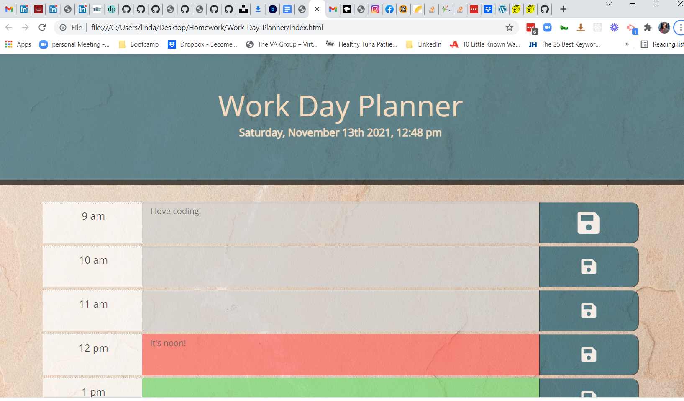
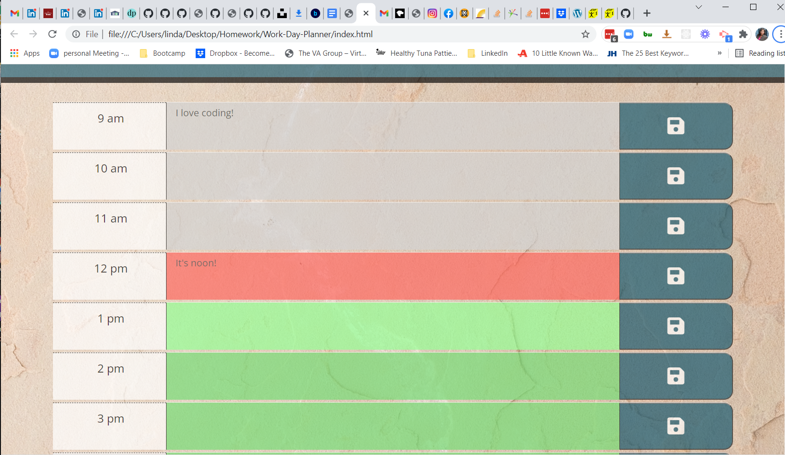
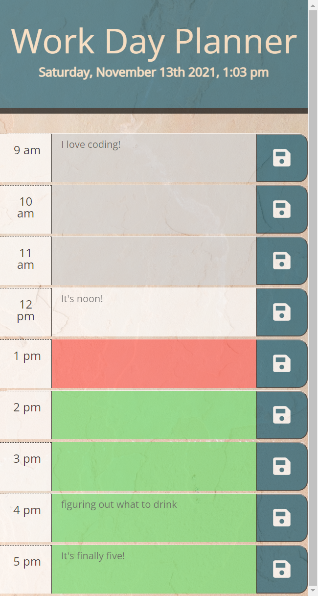

# Work-Day-Planner
A simple planner where you can enter tasks in areas during the work hours and save them.  They will be reloaded into the corresponding times boxes when you reload the program.

## Author
- [@LindaWaterhouse](https://www.github.com/llwaterhouse)

## Description

* In the header area, the current date and and time are displayed and it is updated each minute.

* Time blocks for the workday (0am-5pm) are displayed with a Save button on the side.

* The time blocks are color coded grey for times in the past, coral for the present hour, and green for times in the future.

* The text area turns brighter and the cursor changes when hovering.

* The save button gets larger when hovering.

* When the user enters text and clicks the save button, the text is stored in local storage for that time block.  

* When the program is restarted or refreshed, any stor

* The program is responsive.

* Each minute, the time is checked and if we are into a new hour, the background of the text boxes update.

## Anomalies

* On my local computer I don't get any errors in the console when I load the page.  However, when I uploaded to GitHub, my deployed page gets the following warnings
    * DevTools failed to load source map: Could not load content for chrome-extension://liecbddmkiiihnedobmlmillhodjkdmb/js/content.js.map: HTTP error: status code 404, net::ERR_UNKNOWN_URL_SCHEME

    * DevTools failed to load source map: Could not load content for chrome-extension://liecbddmkiiihnedobmlmillhodjkdmb/js/intercom-link-expand-loader.js.map: HTTP error: status code 404, net::ERR_UNKNOWN_URL_SCHEME

After researching, I found out it has something to do with Chrome adding support for source maps.  To remove this warning, do the following:

    Go to the developer tools (F12 in the browser), and go to Settings.

    Then, look for Sources, and disable the options:

    "Enable JavaScript source maps"
    "Enable CSS source maps"

The warnings then went away on my console

## Built With

* HTML
* CSS
* Javascript
* Bootstrap
* jQuery
* fontawesome
* moment.js

## Prerequisites

If you want to edit this web page you must have a Github account, and have also downloaded Visual Studio Code.

[Create a Github account](https://github.com)

[Download Visual Studio](https://code.visualstudio.com/download/)

## Deliverables

### Screenshots

Initial screenshot hovering over Save button

Display of all colored time blocks hovering over future block

Responsive display on smaller screen

### Repository

[GitHub repository for this project](https://github.com/llwaterhouse/Work-Day-Planner)

### Deployed Application

[The deployed GitPage Application](https://llwaterhouse.github.io/Work-Day-Planner/)

## Acknowledgements

Rutgers Coding Bootcamp

---

© 2021 Linda Waterhouse Consulting. Confidential and Proprietary. All Rights Reserved.

Permission is hereby granted, free of charge, to any person obtaining a copy of this software and associated documentation files (the "Software"), to deal in the Software without restriction, including without limitation the rights to use, copy, modify, merge, publish, distribute, sublicense, and/or sell copies of the Software, and to permit persons to whom the Software is furnished to do so, subject to the following conditions:

The above copyright notice and this permission notice shall be included in all copies or substantial portions of the Software.

THE SOFTWARE IS PROVIDED "AS IS", WITHOUT WARRANTY OF ANY KIND, EXPRESS OR IMPLIED, INCLUDING BUT NOT LIMITED TO THE WARRANTIES OF MERCHANTABILITY, FITNESS FOR A PARTICULAR PURPOSE AND NONINFRINGEMENT. IN NO EVENT SHALL THE AUTHORS OR COPYRIGHT HOLDERS BE LIABLE FOR ANY CLAIM, DAMAGES OR OTHER LIABILITY, WHETHER IN AN ACTION OF CONTRACT, TORT OR OTHERWISE, ARISING FROM, OUT OF OR IN CONNECTION WITH THE SOFTWARE OR THE USE OR OTHER DEALINGS IN THE SOFTWARE.
